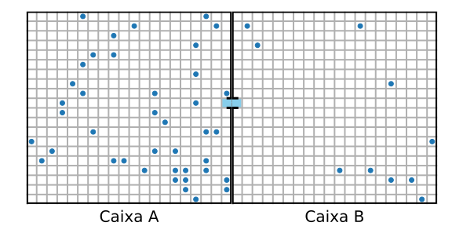

# Modelo de fluxo entre 2 compartimentos

## Objetivo

Simular, usando C++ e mecânica estatística, o fluxo de partículas idênticas entre dois compartimentos por meio de uma pequena abertura.

## Esquematização do modelo

A configuração espacial simulada consiste em dois compartimentos quadrados $A$ e $B$, divididos por células contíguas também quadradas de área padrão. Cada compartimento tem $\sqrt{N}$ células de lado. Os compartimentos são adjacentes, unidos por um dos lados, porém separados entre si e do ambiente externo por paredes rígidas, impermeáveis e diatérmicas.

Cada compartimento inicia a simulação com algumas de suas células preenchidas por partículas e as demais células desocupadas, podendo haver apenas uma única partícula ocupando alguma célula a cada configuração. Há, assim, uma concentração $C$ de partículas em cada compartimento em cada configuração.

Na parede que une os compartimentos há uma abertura os conectando, de apenas uma célula de comprimento, que permite a passagem de uma partícula de cada lado por vez (ou por passo de Monte Carlo). Ou seja, existe mão dupla, significando que a cada passo no máximo duas partículas podem realizar a travessia, uma no sentido $A \rightarrow B$ e outra no sentido contrário.

A figura abaixo ilustra a configuração espacial do modelo:

*Configuração espacial do modelo, no caso em que o lado de cada compartimento é $\sqrt{N}=20$, a concentração normalizada de $A$ é $0.2$ e de $B$ é $0.05$. Células imediatamente adjacentes à abertura figuram com coloração destacada.*

A simulação consiste em um processo de Monte Carlo em que vários microestados do sistema são amostrados por meio de uma cadeia de Markov. A partir de uma configuração inicial com diferentes concentrações da partícula em cada compartimento, podem ser calculados dois conjuntos de probabilidades:

1. A probabilidade $P^{(k)}_v$ de que uma partícula no compartimento $k$ se encontre na célula imediatamente adjacente à abertura (tal célula de cada caixa se encontra colorida na figura); e
2. Caso haja uma partícula nesta célula, a probabilidade $P^{(k)}_p$ de que ela passe para o outro compartimento.

Tais probabilidades são usadas para amostrar microestados e serão explicadas em mais detalhes abaixo.

## Probabilidade 1: presença de partícula na vizinhança da abertura

Referências adotadas:
Barreto
Philips
André/Morgado ?

O modelo considera que só pode haver fluxo de partículas de um compartimento para o outro caso exista, no microestado considerado, uma partícula na célula adjacente à abertura.

Visto que o estudo se foca na evolução da concentração de partículas, não temos interesse na configuração exata das demais partículas a cada microestado, apenas na variável $C$ de cada compartimento. Assim, se pudermos calcular somente a probabilidade de uma partícula estar na célula de interesse, podemos usar uma abordagem probabilística e não precisamos simular o movimento de cada partícula. 

Existem $N$ células em cada compartimento e $L^{(k)}$ partículas no compartimento $k$. A contagem $\Omega^{(k)}$ do total de microestados acessíveis a um compartimento isolado é análogo ao número de permutações de uma palavra de duas letras (p.ex., $u$ e $v$), com $N$ letras no total e $L^{(k)}$ letras de interesse (representando a presença de partículas). A fórmula para esse tipo de permutação é:

$$\Omega^{(k)}(N, L^{(k)}) = \frac{N!}{L^{(k)}!\,(N-L^{(k)})!} $$

Dentre esses microestados, podemos contar apenas aqueles que possuem uma partícula na célula adjacente. Dado que o estado de uma célula e uma partícula está fixo, sobram $N-1$ células e $L_k-1$ partículas a serem permutadas. A fórmula desta nova contagem $\Omega_v^{(k)}$ é análoga:

$$\Omega_v^{(k)}(N, L^{(k)}) = \frac{(N-1)!}{(L^{(k)}-1)!\,[N-1-(L^{(k)}-1)]!}=\frac{(N-1)!}{(L^{(k)}-1)!\,(N-L^{(k)})!}$$

, onde uso o subfixo $v$ para significar que há uma partícula "vizinha" à abertura.

A probabilidade $P^{(k)}_v$ de que haja uma partícula vizinha é então a fração:

$$ P^{(k)}_v = \frac{\Omega_v^{(k)}}{\Omega^{(k)}} = \frac{(N-1)!}{(L^{(k)}-1)!\,(N-L^{(k)})!} \frac{L^{(k)}!\,(N-L^{(k)})!}{N!} $$

$$= \frac{\cancel{(N-1)!}}{\cancel{(L^{(k)}-1)!\,(N-L^{(k)})!}} \frac{L^{(k)}\cancel{(L^{(k)}-1)!\,(N-L^{(k)})!}}{N\cancel{(N-1)!}}$$

$$ \Leftrightarrow $$

$$ P^{(k)}_v = \frac{L^{(k)}}{N}$$

A concentração de partículas em cada compartimento pode ser definida como

$$C^{(k)}=\frac{L^{(k)}}{V}$$

, onde $V$ é a área ou volume dos compartimentos.

Seja $v_0$ o volume de cada célula (volume elementar), de modo que $V=N\,v_0$, podemos definir também uma referência de concentração máxima em cada compartimento, isto é, a concentração igual a uma partícula por célula, dada por:

$$C_0=\frac{1}{v_0}$$

Usando essas definições, podemos deixar a probabilidade de partícula vizinha em termos unicamente da concentração:

$$P_v^{(k)} = \frac{L^{(k)}}{N} \frac{C_0}{C_0} = \frac{L^{(k)}}{Nv_0}\frac{1}{C_0}$$

$$\Leftrightarrow$$

$$P_v^{(k)}=\frac{C^{(k)}}{C_0}$$

Dada uma configuração inicial de concentrações $C^{(A)}$ e $C^{(B)}$, sorteamos para cada compartimento um número aleatório entre $0$ e $1$. Se ele for maior que $P_v^{(k)}$ para ambos os compartimentos, consideramos que o passo de Monte Carlo foi tomado e passamos ao próximo passo, porque não há nenhum fluxo de partículas possível. Caso contrário, se $P_v^{(k)}$ for maior que o número sorteado para um ou ambos os compartimentos, passamos a calcular a(s) probabilidade(s) de a(s) respectiva(s) partícula(s) trocar(em) de compartimento.

## Probabilidade 2: troca de compartimento

## Otimizações

### Evitando recalcular C

### Algoritmo de metropolis
