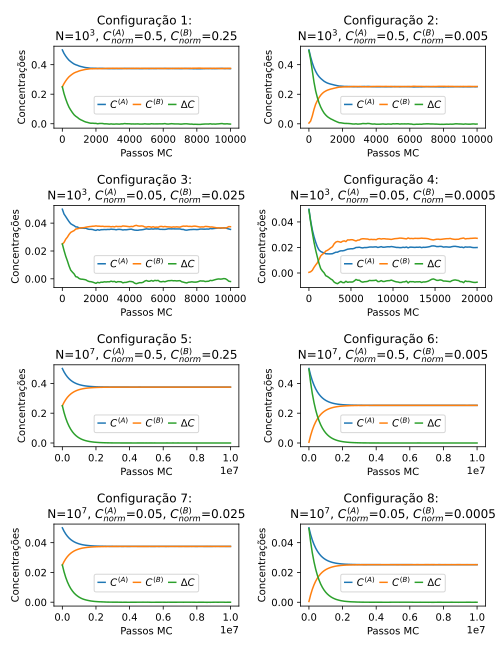

# Modelo de fluxo entre 2 compartimentos

## Objetivo

Simular, usando C++ e mecânica estatística, o fluxo de partículas idênticas entre dois compartimentos por meio de uma pequena abertura.

## Esquematização do modelo

A configuração espacial do modelo consiste em dois compartimentos quadrados $A$ e $B$ divididos em células contíguas também quadradas de área padrão. Cada compartimento tem $\sqrt{N}$ células de lado. Os compartimentos são adjacentes, unidos por um dos lados, porém separados entre si e do ambiente externo por paredes rígidas, impermeáveis e diatérmicas.

Cada compartimento inicia a simulação com algumas de suas células preenchidas por partículas e as demais células desocupadas, podendo haver apenas uma única partícula ocupando alguma célula a cada configuração. Há, assim, uma concentração $C$ de partículas em cada compartimento em cada configuração.

Na parede que une os compartimentos há uma abertura os conectando, de apenas uma célula de comprimento, que permite a passagem de uma partícula de cada lado por vez (ou por passo de Monte Carlo). Ou seja, existe mão dupla, significando que a cada passo no máximo duas partículas podem realizar a travessia, uma no sentido $A \rightarrow B$ e outra no sentido contrário.

A figura abaixo ilustra a configuração espacial do modelo:

*Configuração espacial do modelo, no caso em que o lado de cada compartimento é $`\sqrt{N}=20`$, a concentração normalizada de $`A`$ é $`0.2`$ e de $`B`$ é $`0.05`$. Células imediatamente adjacentes à abertura figuram com coloração destacada.*

A simulação consiste em um processo de Monte Carlo em que vários microestados do sistema são amostrados por meio de uma cadeia de Markov. A partir de uma configuração inicial com diferentes concentrações da partícula em cada compartimento, podem ser calculados dois conjuntos de probabilidades:

1. A probabilidade $P^{(k)}_v$ de que uma partícula no compartimento $k$ se encontre na célula imediatamente adjacente à abertura (tal célula de cada caixa se encontra colorida na figura); e
2. Caso haja uma partícula nesta célula, a probabilidade $P^{(k)}_p$ de que ela passe para o outro compartimento.

Tais probabilidades são usadas para amostrar microestados sucessivos e serão explicadas em mais detalhes abaixo.

As referências usadas na parte teórica dessas anotações foram:  
***Yan Barreto Tese de Doutorado  
Philips et al Physical Biology of the Cell  
Morgado Análise Combinatória***

## Probabilidade 1: presença de partícula na vizinhança da abertura

O modelo considera que só pode haver fluxo de partículas de um compartimento para o outro caso exista, no microestado considerado, uma partícula na célula adjacente à abertura.

Visto que o estudo se foca na evolução da concentração de partículas, não temos interesse na configuração exata das demais partículas a cada microestado, apenas na variável $C$ de cada compartimento. Assim, se pudermos calcular somente a probabilidade de uma partícula estar na célula de interesse, podemos usar uma abordagem probabilística e não precisamos simular o movimento ou manter o registro da posição de cada partícula individualmente. 

Existem $N$ células em cada compartimento e $L^{(k)}$ partículas no compartimento $k$. A contagem $\Omega^{(k)}$ do total de microestados acessíveis a um compartimento isolado é análogo ao número de permutações de uma palavra de duas letras com $N$ caracteres no total e $L^{(k)}$ cópias da letra de interesse (representando a presença de partículas). A fórmula para esse tipo de permutação é:

$$\Omega^{(k)}(N, L^{(k)}) = \frac{N!}{L^{(k)}!(N-L^{(k)})!} $$

Dentre esses microestados, podemos contar apenas aqueles que possuem uma partícula na célula adjacente. Dado que o estado desta célula e a partícula que a ocupa está fixo, sobram $N-1$ células e $L^{(k)}-1$ partículas a serem permutadas. A fórmula desta nova contagem $\Omega_v^{(k)}$ é análoga:

$$\Omega_v^{(k)}(N, L^{(k)}) = \frac{(N-1)!}{(L^{(k)}-1)![N-1-(L^{(k)}-1)]!}=\frac{(N-1)!}{(L^{(k)}-1)!(N-L^{(k)})!}$$

, onde uso o subfixo $v$ para significar que há uma partícula "vizinha" à abertura.

A probabilidade $P^{(k)}_v$ de que haja uma partícula vizinha é então a fração:

$$ P^{(k)}_v = \frac{\Omega_v^{(k)}}{\Omega^{(k)}} = \frac{(N-1)!}{(L^{(k)}-1)!(N-L^{(k)})!} \frac{L^{(k)}!(N-L^{(k)})!}{N!} $$

$$= \frac{\cancel{(N-1)!}}{\cancel{(L^{(k)}-1)!(N-L^{(k)})!}} \frac{L^{(k)}\cancel{(L^{(k)}-1)!(N-L^{(k)})!}}{N\cancel{(N-1)!}}$$

$$ \Leftrightarrow $$

$$ P^{(k)}_v = \frac{L^{(k)}}{N}$$

A concentração de partículas em cada compartimento pode ser definida como

$$C^{(k)}=\frac{L^{(k)}}{V}$$

, onde $V$ é a área ou volume dos compartimentos.

Seja $v_0$ o volume de cada célula (nesse caso, uma área quadrada elementar), de modo que $V=Nv_0$, podemos definir também uma referência de concentração máxima em cada compartimento, isto é, a concentração igual a uma partícula por célula, dada por:

$$C_0=\frac{1}{v_0}$$

Usando essas definições, podemos deixar a probabilidade de partícula vizinha em termos unicamente da concentração:

$$P_v^{(k)} = \frac{L^{(k)}}{N} \frac{C_0}{C_0} = \frac{L^{(k)}}{Nv_0}\frac{1}{C_0}$$

$$\Leftrightarrow$$

$$P_v^{(k)}=\frac{C^{(k)}}{C_0}$$

, onde o termo da direita também pode ser pensado como a concentração normalizada. Por conveniência, visto estarmos trabalhando com unidades arbitrárias, defino $v_0 = 1$.

Dada uma configuração inicial de concentrações $C^{(A)}$ e $C^{(B)}$, sorteamos para cada compartimento um número aleatório entre $0$ e $1$. Se ele for maior que $P_v^{(k)}$ para ambos os compartimentos, consideramos que o passo de Monte Carlo foi tomado e passamos ao próximo passo, porque não há nenhum fluxo de partículas possível no microestado atual. Caso contrário, se $P_v^{(k)}$ for maior que o número sorteado para um ou ambos os compartimentos, passamos a calcular a(s) probabilidade(s) de a(s) respectiva(s) partícula(s) trocar(em) de compartimento.

***dúvida: nesse modelo, é realmente necessário calcular a probabilidade de haver partícula na vizinhança?***

## Probabilidade 2: troca de compartimento

A probabilidade $P_p$ de haver troca de compartimento é determinada por aspectos teóricos da termodinâmica e da mecânica estatística do modelo. Adoto o subfixo $p$ para denotar a situação em que há a "passagem" da partícula.

Visto que não há diferenças de temperatura ou potencial eletrostático, a diferença $\Delta E$ de energia livre entre os compartimentos é dada pela diferença $\Delta \mu$ de pontencial químico:

$$\Delta \mu = \mu^{(A)} - \mu^{(B)} = k_B T \ln{\left( \frac{C^{(A)}}{C^{(B)}}\right) }$$

, sendo $k_B$ a constante de Boltzmann e $T$ a temperatura do sistema (que presumo constante). Como estou trabalhando em unidades arbitrárias, adoto $k_B T = 1$. Vale mencionar que este resultado é obtido usando-se a aproximação de Stirling.

Entre dois microestados com diferentes concentrações $C^{(A)}$ e $C^{(B)}$, haverá níveis diferentes de energia livre total. Pela minimização de energia livre, é de se supor que no equilíbrio $\Delta \mu \rightarrow 0$. Ou seja, a energia livre total $E$ é mínima quando $\mu^{(A)} = \mu^{(B)} \Leftrightarrow L^{(A)} = L^{(B)}$. Se tomarmos esse ponto de mínimo como referência de nível basal de energia (i.e. onde $E=0$), então $\Delta \mu$ se torna equivalente à energia do microestado, ou seja, $E=\Delta \mu$, e posso usar esse número nos cálculos.

***DÚVIDA: O PROCEDIMENTO ABAIXO É O ALGORITMO DE METROPOLIS? É LEGÍTIMO?***

Para determinar se haverá passagem da partícula pela abertura, primeiro comparo a energia $E_i$ do microestado inicial $i$ (anterior à passagem) com a energia $E_f$ microestado final $f$ (posterior à passagem). Se $E_i > E_f$, o que equivale a $\Delta \mu_i > \Delta \mu_f$, defino $P_p = 1$. Ou seja, a passagem é feita e as concentrações de cada compartimento são atualizadas.

No entanto, se a energia posterior é maior, ainda existe uma probabilidade de a partícula passar. Da mecânica estatística, em sistemas mantidos a temperatura constante, a probabilidade de o sistema se encontrar em certo microestado é dada pela distribuição de Bolzmann. Podemos comparar a probabilidade $P_i$ de um microestado anterior com a probabilidade $P_f$ do microestado posterior:

$$ \frac{P_f}{P_i} = \frac{\frac{e^{-\beta E_f}}{Z}}{\frac{e^{-\beta E_i}}{Z}} = e^{-\beta (\Delta \mu_f - \Delta \mu_i)} $$

, em que $Z$ é a função de partição e $\beta = 1/k_BT$ (aqui, $1$). Nota-se que a exponencial acima é $<1$ porque se aplica apenas ao caso em que $\Delta \mu_f > \Delta \mu_i$. Assim, podemos tratá-la como a probabilidade $P_p$ de haver passagem nesse caso. 

Em suma, a expressão para $P_p^{(k)}$ é:

$$
P_p^{(k)} = \left\{
\begin{array}{ll}
1 & \text{se } \Delta \mu_f < \Delta \mu_i \\
e^{-\beta (\Delta \mu_f - \Delta \mu_i)} & \text{se } \Delta \mu_f \geq \Delta \mu_i 
\end{array}
\right.
$$

Para cada partícula vizinha à abertura no microestado considerado, sorteamos um número entre $0$ e $1$ e comparamos com essa probabilidade. Se o número é $` < P_p^{(k)}`$, a partícula passa de $k$ até o compartimento vizinho, caso contrário não passa.

## Comportamento das partículas na abertura e nas células vizinhas

Vale considerar brevemente a situação em que há duas partículas na vizinhança da abertura, uma no compartimento $A$ e outra no compartimento $B$. Pode-se cogitar 4 casos: 

1. Nenhuma passa;
2. Ambas passam, usando a propriedade de mão dupla da abertura;
3. Apenas a partícula do compartimento $A$ passa;
4. Apenas a partícula do compartimento $B$ passa.

Visto que $P_p = 1$ quando a energia posterior à passagem é menor, o caso 1 não é uma possibilidade, pois alguma das duas passagens ($A \rightarrow B$ ou $A\leftarrow B$) implicará menor energia posterior (ou seja, nessa situação, uma das partículas sempre irá passar). Se ambas passam (caso 2), a energia posterior é igual à anterior. Se apenas uma passa (casos 3 ou 4), então a propriedade de mão dupla não é usada e o caso se reduz à existência de apenas uma partícula na vizinhança. 

Vale também esclarecer como é tratada a ocupação das células vizinhas. Após a passagem de uma partícula, não se considera que ela passa a ocupar a célula vizinha à abertura no compartimento oposto. Considera-se que a partícula é simplesmente liberada em qualquer outra célula do compartimento oposto.

Isso tem duas consequências.

Primeiro, na situação em que há duas partículas, uma partícula não atrapalha a passagem da outra, ou seja, se há a passagem de apenas uma partícula, a partícula ocupando a célula vizinha do compartimento oposto não impede a passagem da primeira. Em conjunto com o que foi explicado acimade, isso significa que a propriedade de mão dupla não traz nenhuma complexidade computacional adicional, sendo simplesmente equivalente à existência de dois canais de mão única, um em cada sentido.

Segundo, o microestado posterior a ser amostrado não é automaticamente caracterizado pela presença de uma partícula na célula vizinha à abertura do compartimento receptor. Esta presença é determinada sempre no próximo passo, por $P_v^{(k)}$. Isso reflete a simples intuição física de que uma partícula que acaba de atravessar tem momento em sentido contrário ao compartimento de onde saiu, e portanto não se pode supor que ela necessariamente permanecerá na vizinhança da abertura, disponível para uma nova passagem. Computacionalmente, me parece que essa escolha possui a vantagem de que não é preciso manter registro do estado do microestado posterior para uso no passo futuro de Monte Carlo, evitando uma comparação condicional, mas possui também a desvantagem de que um número aleatório sempre deve ser gerado. É possível que esta abordagem não seja a escolha mais ótima, e de um ponto de vista físico cogito se a intuição de momento estaria apropriada, mas essas questões permanecem como exercício de investigação futuro.

## Experimento e coleta de dados

Como o modelo não registra a configuração específica de cada microestado, mas apenas as concentrações dos compartimentos, só é necessário partir de uma configuração inicial de concentrações e alterar tais valores sempre que houver a passagem de uma partícula. Na prática, visto que o número de células $N$ e a área elementar $v_0$ são constantes, basta inicializarmos o número inicial de partículas em cada compartimento $L_0^{(A)}$ e $L_0^{(B)}$ e incrementarmos/decrementarmos esse valor a cada passagem.

Para posterior visualização da evolução das concentrações, não é necessário salvar as concentrações a cada passo de Monte Carlo porque é realizado um número muito grande de passos. O registro é feito periodicamente a cada $x$ passos ("coleta de dados" do experimento). É realizado um número $M$ de passos de Monte Carlo suficientes para atingir o equilíbrio.

A partir de uma mesma configuração inicial $(N, C^{(A)}, C^{(B)})$, o modelo é rodado $100$ vezes, cada vez até a respectiva equilibração. Como resultado, tiro a média dos níveis de concentração observados a cada período $x$, sendo o desvio padrão a incerteza.

Realizei o mesmo procedimento para um total de $8$ configurações iniciais, de modo a refletir: compartimentos menores ($N=10^3$) e maiores ($N=10^7$); diferenças de concentração entre os compartimentos pequenas (2 vezes) e grandes (100 vezes); e concentrações normalizadas do compartimento mais denso maiores (ordem $10^{-1}$) e menores (ordem $10^{-2}$).

O número total de passos de Monte Carlo $M$ variou conforme a configuração, pois foi possível observar que o tempo de equilibração é muito diferente. No entanto, para manter uma padronização na visualização de resultados, mantive $M$ múltiplo de $100$ e $x = M/100$, de modo que foram coletados 100 dados igualmente espaçados em todos os loops de Monte Carlo.

## Resultados

Conforme ilustrado na figura, a simulação gerou uma convergência aparentemente exponencial das concentrações entre os dois compartimentos, conforme o esperado.

*Resultados nas diferentes configurações. $`N\equiv`$ número de células em cada compartimento, $`C_{norm}^{(k)}\equiv`$ concentração inicial no compartimento $`k`$.*

No entanto, é de se notar que nas configurações 3 e 4 não fizeram $\Delta C \rightarrow 0$, e, portanto, tampouco $\Delta \mu \rightarrow 0$, o que não condiz com o esperado. Cogito que a explicação para isso esteja no fato de que essas configurações são as de menor número $L$ de partículas, pois têm o menor tamanho total $N$ de células em cada compartimento e as menores concentrações normalizadas iniciais. A configuração 4 em especial tem apenas 50 partículas. O que pode estar acontecendo é a influência do erro da aproximação de Stirling, que só é válida para $L \gg 1$. 

## A inserir futuramente

### Comprovar que os resultados das configs. 3 e 4 se devem ao erro da aprox. de Stirling

### Investigação das flutuações

### Demonstração das equações da probabilidade 2

### Possibilidade de uso do algoritmo de Metropolis

### Possíveis extensões futuras

#### Cotransporte

#### Gradiente eletrostático